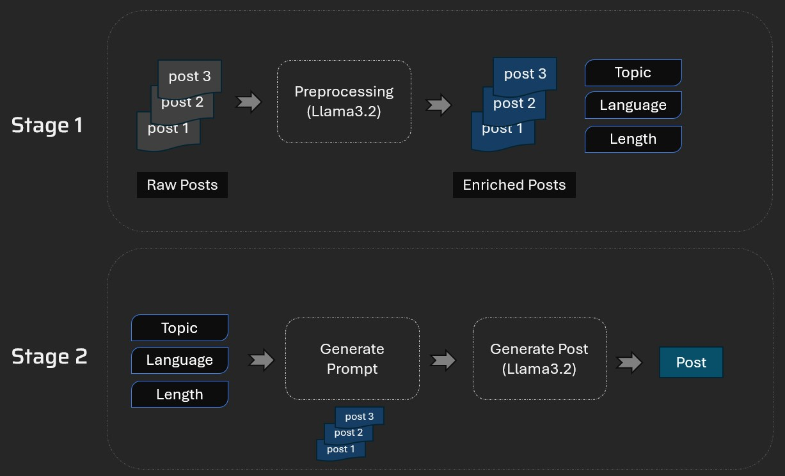
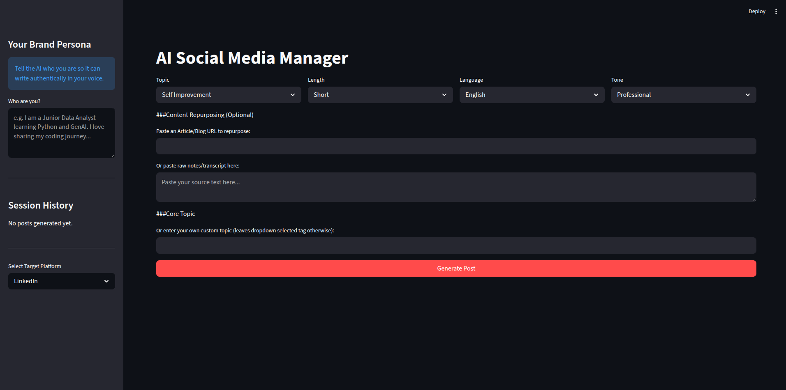
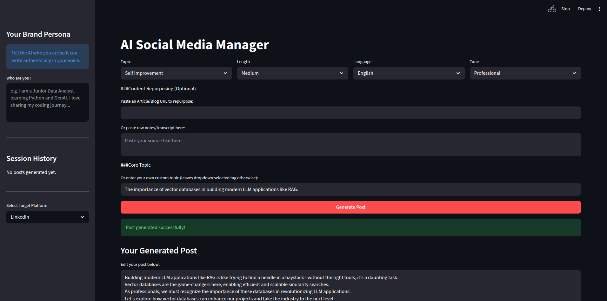
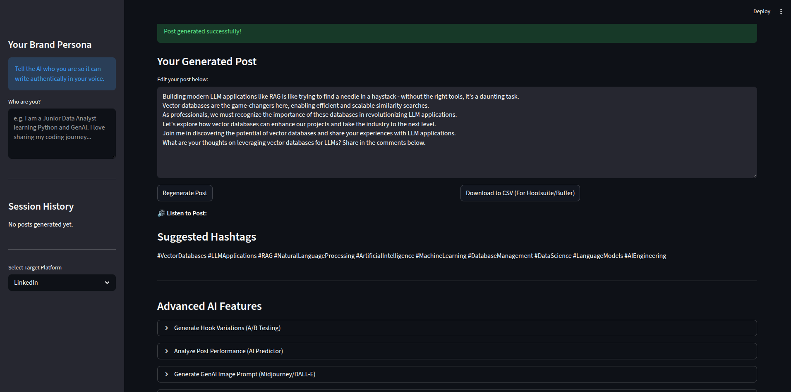
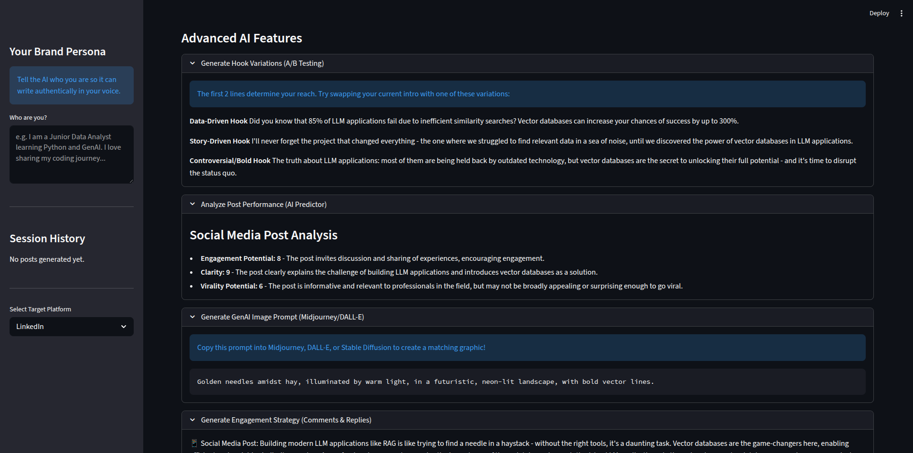
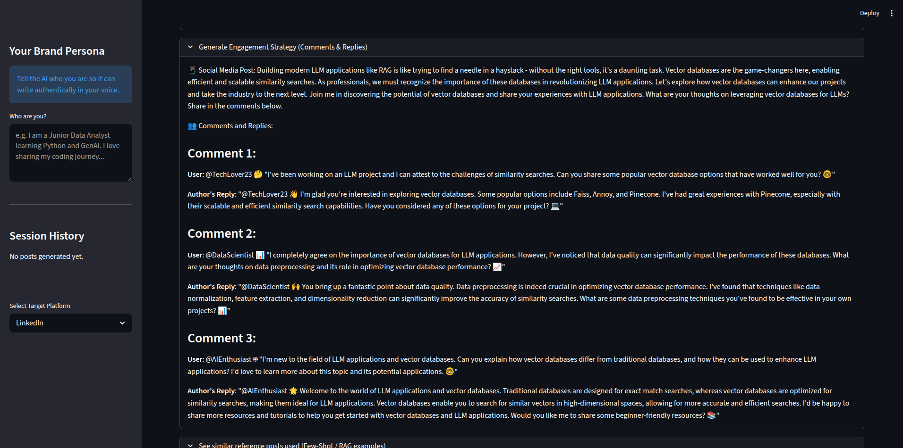

#  PostGenie : AI Social Media Manager & Post Generator

A sophisticated full-stack GenAI application designed to help content creators and professionals scale their personal brands across LinkedIn, Twitter, and Instagram. built with **Streamlit, LangChain, and Groq**. This tool goes way beyond a standard wrapper by implementing **Retrieval-Augmented Generation (RAG), Web Scraping, Multi-Agent Prompt Chaining, and Multimodal Text-to-Speech (TTS)** to help creators scale their personal brand.

## Technical Architecture



1. Stage 1: Collect LinkedIn posts and extract Topic, Language, Length etc. from it.
1. Stage 2: Now use topic, language and length to generate a new post. Some of the past posts related to that specific topic, language and length will be used for few shot learning to guide the LLM about the writing style etc.

## Key Features

### Advanced AI Workflows
* **Multi-Platform Support:** Generates formatted content for LinkedIn, Twitter, and Instagram in 6 different languages.
* **Hook A/B Testing Engine:** Automatically reverse-engineers generated posts to create 3 alternative, highly-engaging intros (Data-driven, Story-driven, Controversial).
* **AI Post Performance Predictor:** A critic agent evaluates the finalized post on Virality, Engagement, and Clarity (1-10 scale).
* **GenAI Image Prompt Creator:** Automatically writes a highly detailed 40-word Midjourney/DALL-E prompt based on the content of the post.
* **Engagement Auto-Replies:** Predicts probable audience comments and writes the perfect creator replies for you.

### Data Engineering & RAG

* **Vector RAG Engine:** Uses `faiss-cpu` and `sentence-transformers` to map your custom topic against a vector database of past viral posts. It injects the most mathematically similar ones into the context window as Few-Shot examples to guarantee tone matching.
* **URL Web Scraping (Content Repurposer):** Built-in `BeautifulSoup4` pipeline. Paste a link to any blog or news article, and the app will crawl it, extract the clean text, and autonomously repurpose it into a social post.
* **Brand Persona Injection:** Remembers "who you are" so the AI writes authentically from your perspective instead of sounding like a generic robot.

### User Experience (UX)

* **Session State History:** Uses Streamlit's internal memory to save a gallery of every post you generate in the sidebar—never lose your work when the page reloads!
* **Multimodal Text-to-Speech:** Integrated `pyttsx3` to synthesize your post into an MP3 player directly in the browser.
* **One-Click CSV Export:** Download your generated content seamlessly into a `.csv` formatted perfectly for enterprise schedulers like Hootsuite and Buffer.


##  Screenshots

### Dashboard


### Sample Input


### Output




## Technical Stack

* **Frontend:** Streamlit, Pandas
* **Backend / AI:** Python, LangChain, Groq API (LLaMA3)
* **Vector Database:** FAISS, Sentence-Transformers
* **Data Ingestion:** BeautifulSoup4, Requests
* **Multimodal:** pyttsx3

## Set-up

1. To get started we first need to get an API_KEY from here: https://console.groq.com/keys. Inside `.env` update the value of `GROQ_API_KEY` with the API_KEY you created. 
2. To get started, first install the dependencies using:
    ```commandline
     pip install -r requirements.txt
    ```
3. Run the streamlit app:
   ```commandline
   streamlit run main.py


